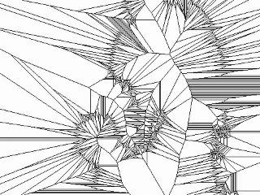

# Bad Apple
Bad Apple but it's a Voronoi diagram!
[Voronoi diagram](https://en.wikipedia.org/wiki/Voronoi_diagram) is a partition of a plane into regions close to each of a given set of objects.

My video can be found [here](https://youtu.be/0KhqEXIit7w).

# Running this code/Pre-requisites
You can either `git clone` or download a ZIP of this repository. 

`git clone https://github.com/marsh-fish/VoronoiBadApple`

Then, ensure that you set your terminal to the directory of this repository. 

`cd VoronoiBadApple`

Install the necessary dependencies and packages by using:

`pip install -r requirements.txt`

And to run the code:

`python voronoi_bad_apple.py`
